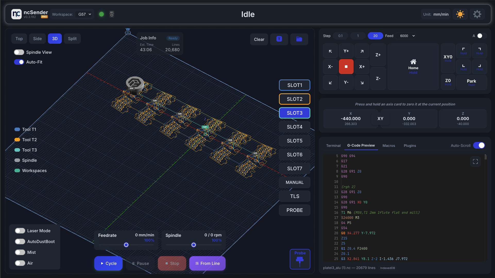
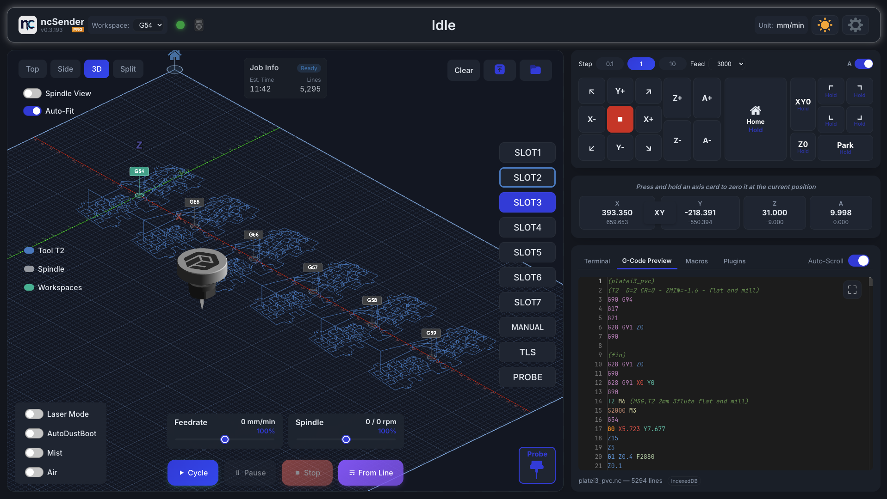
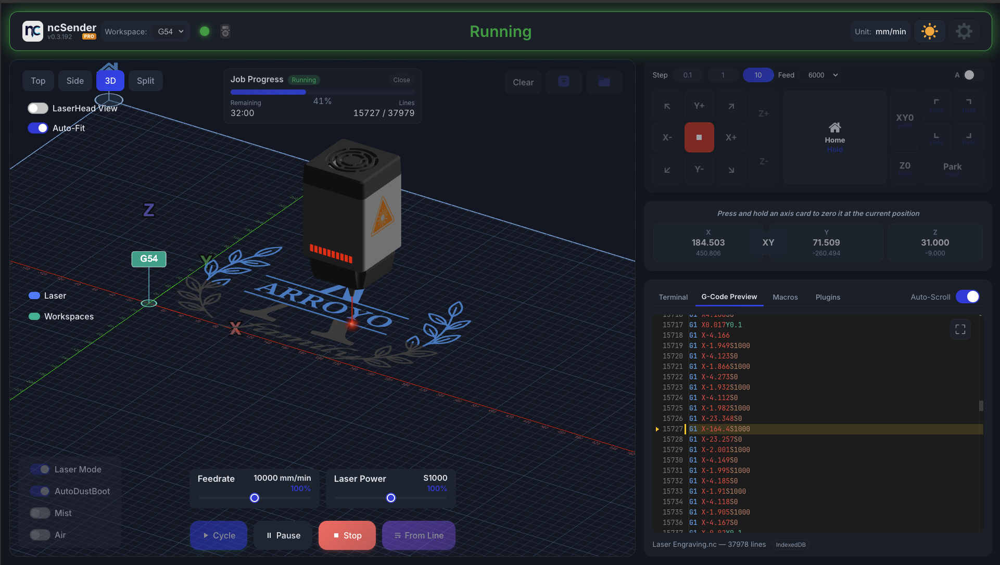
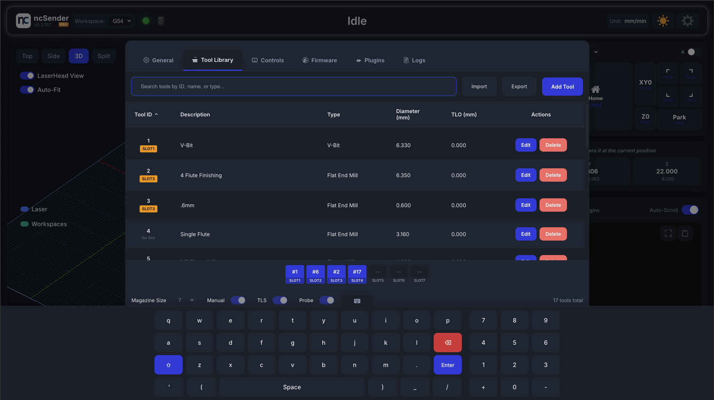

# ncSenderPro Releases

Official release binaries for **ncSenderPro** - a professional CNC streaming software for GRBL-based machines.

## Features

### Multi-Workspace
Run multiple workspaces (G54–G59) in a single job, each with its own work offset and toolpath — ideal for batch production and tiling setups.



### 4th Axis Support
Full 4th axis (A-axis) control with 3D visualization for rotary and indexing operations.



### Laser Mode
Dedicated laser mode with real-time power visualization, feedrate and laser power overrides, and LaserHead view for precise beam positioning.



### Trace
Trace your toolpath bounding box directly on the material or workpiece to see if the job will fit.


### Virtual Keyboard
Built-in virtual keyboard for kiosk and touchscreen setups where no physical keyboard is attached, allowing input on any text field.



### Safety Door Intelligence


Enhanced safety door handling for professional machines with `$61` (Ignore when idle) support:
- **Automatic spindle stop** — When the door opens while the spindle is running manually (no active job), M5 is sent automatically to stop the spindle immediately.
- **Controlled jogging in door state** — Allows slow jogging while the door is open for setup and inspection, with feed rate automatically limited to safe speeds (1000 mm/min).
- **Safety command processor** — All jog commands from both the UI and pendant are routed through the safety processor, which limits feed rates and blocks unsafe rapid moves when the door is open.
- **Clear terminal feedback** — Door-limited commands are annotated in the terminal so operators can see when and why limits are applied.

## Download

Download the latest release for your platform from the [Releases](https://github.com/siganberg/ncSenderProReleases/releases) page.

### Available Platforms

| Platform | Architecture | Format |
|----------|--------------|--------|
| Windows | x64 | `.exe` |
| macOS | Apple Silicon (arm64) | `.dmg` |
| Linux | x64 | `.deb` |
| Linux | ARM64 (Raspberry Pi) |  `.deb` |

## Installation

### Windows
Download and run the `.exe` installer.

### macOS
1. Download the `.dmg` file for your Mac
2. Open the DMG and drag ncSender Pro to Applications
3. Since the app is not code-signed by Apple, you'll need to clear the quarantine attribute before running:
   ```bash
   xattr -c /Applications/ncSender\ Pro.app
   ```
   Open Terminal (Applications → Utilities → Terminal), paste the command above, and press Enter. After that, you can open ncSender Pro normally.

### Linux

**Debian/Ubuntu (.deb):**
```bash
sudo dpkg -i ncSender_*.deb
```

### Raspberry Pi (ARM64)
Download the Linux ARM64 `.AppImage` or `.deb` package. Requires 64-bit Raspberry Pi OS.

## License

ncSender Pro requires an Installation ID to run. Purchase one at [franciscreation.com/ncsenderpro](https://www.franciscreation.com/ncsenderpro).

After purchase, you'll receive an Installation ID via email. Enter this ID in the app to activate your license.

## Support

- Website: [franciscreation.com](https://franciscreation.com)
- Issues: For bug reports and feature requests, please contact support

## About

ncSender Pro is the commercial version of ncSender with additional features for professional CNC users.

---

Copyright (c) 2026 Francis Creation. All rights reserved.
